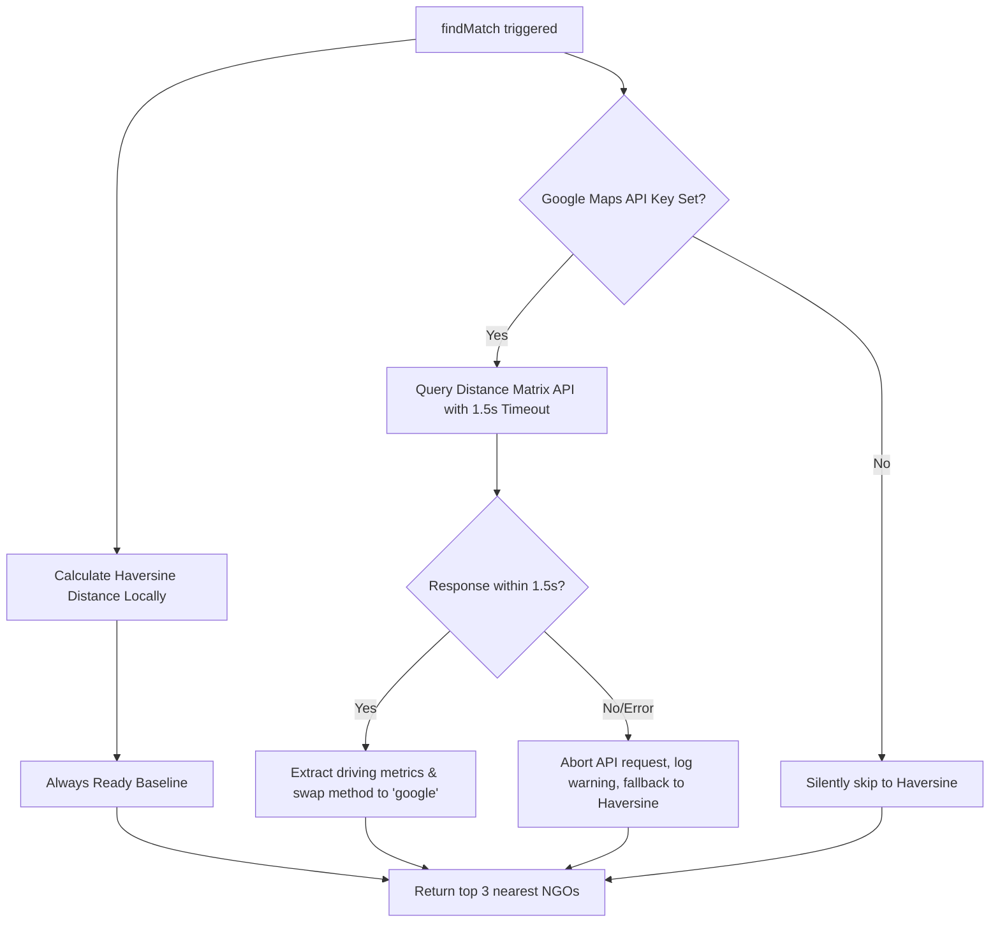

# Food Rescue AI

A production-grade, reliable hackathon venue prototype designed to connect restaurants having surplus food with nearby NGOs, utilizing volunteers to handle the delivery logistics. 

This repository houses the **fully functional Firebase Backend** (including Cloud Functions, Security Rules, and Emulator configurations) and a **React + Vite Frontend Scaffold** featuring role-based dashboards.

---

## 📖 Table of Contents
1. [Project Overview](#-project-overview)
2. [Flat Directory Layout](#-flat-directory-layout)
3. [System Architecture & Critical Design Decisions](#-system-architecture--critical-design-decisions)
4. [Firestore Database Schema](#-firestore-database-schema)
5. [Backend Cloud Functions](#-backend-cloud-functions)
6. [Firestore Security Rules](#-firestore-security-rules)
7. [React Client Scaffold](#-react-client-scaffold)
8. [Local Quickstart & Seeding](#-local-quickstart--seeding)
9. [Integration Testing & Verification](#-integration-testing--verification)

---

## 🌟 Project Overview

Food waste is a major contributor to global carbon emissions, yet millions of people face food insecurity daily. **Food Rescue AI** streamlines rescue operations:
1. **Restaurants** post surplus food listings and view historical waste analytics.
2. **NGOs** view nearby listings matching their current capacity and claim them.
3. **Volunteers** receive match alerts, accept deliveries, and use mapping coordinates to execute the pickup and drop-off.
4. **Administrators** monitor global real-time matches and platform impact (total meals saved and carbon offsets).

---

## 📂 Flat Directory Layout

```
food-rescue/
├── firebase/               # Backend Firebase Configuration
│   ├── functions/          # Node.js 22 Cloud Functions
│   │   ├── index.js        # Main Exports Entrypoint
│   │   ├── matching.js     # findMatch Callable logic
│   │   ├── predictWaste.js # predictWaste Callable logic
│   │   ├── impact.js       # onDocumentUpdated Firestore Trigger
│   │   └── utils/
│   │       └── distance.js # Haversine & Google Maps APIs
│   ├── seed/               # Database Seeder Tool
│   │   ├── seed.js         # Populates Delhi area coordinates
│   │   └── package.json
│   ├── firestore.rules     # Client Access Rules
│   └── firebase.json       # Ports & Emulator Configs
├── client/                 # React + Vite Frontend Scaffold
│   ├── src/
│   │   ├── components/     # Mock UI blocks (TabNav, MockMap, cards...)
│   │   ├── pages/          # Role-based dashboard interfaces
│   │   ├── hooks/          # Mock custom Firebase shell hooks
│   │   └── firebase/
│   │       └── config.js   # Empty configuration shell
│   ├── package.json
│   └── vite.config.js
└── README.md               # Main Documentation (This File)
```

---

## ⚡ System Architecture & Critical Design Decisions

### Live Demo Venue Wifi Resiliency
When pitching live at a hackathon, unstable venue Wi-Fi frequently breaks APIs, resulting in failed demos. To prevent this, the distance calculation in **Food Rescue AI** implements a **Haversine-first architecture**:



- **Zero-Dependency Baseline**: Straight-line (Haversine) calculations are executed locally on the server immediately.
- **Optional API Upgrade**: Concurrently, the function executes a call to the **Google Maps Distance Matrix API** to retrieve real-world driving distance and transit times.
- **1.5-Second Strict Timeout**: The Google Maps request is bound to an `AbortController`. If it takes longer than 1500ms, it is aborted.
- **Silent Failure Handling**: If the API call times out, fails, returns a quota error, or lacks an API key, the error is caught silently. The backend logs a server-side warning and returns the Haversine result with `method: "haversine"` instead of `method: "google"`. Demos continue uninterrupted!

---

## 🗄️ Firestore Database Schema

### `/restaurants/{id}`
```json
{
  "name": "Spice Garden",
  "location": { "lat": 28.6519, "lng": 77.2315 },
  "pastListingsKg": [8, 9, 8, 9, 13, 14, 9]
}
```

### `/ngos/{id}`
```json
{
  "name": "Helping Hands",
  "location": { "lat": 28.6470, "lng": 77.2260 },
  "capacityKg": 20
}
```

### `/volunteers/{id}`
```json
{
  "name": "Rahul",
  "available": true,
  "location": { "lat": 28.6500, "lng": 77.2300 }
}
```

### `/foodListings/{id}`
```json
{
  "restaurantId": "spice_garden",
  "restaurantName": "Spice Garden",
  "restaurantLocation": { "lat": 28.6519, "lng": 77.2315 },
  "foodType": "Veg Meals",
  "quantityKg": 12,
  "expiryHours": 4,
  "status": "posted", // "posted" | "claimed" | "picked_up" | "delivered"
  "claimedByNgo": null,
  "claimedByNgoName": null,
  "assignedVolunteer": null,
  "createdAt": "timestamp"
}
```

### `/matches/{id}`
```json
{
  "listingId": "listing_document_id",
  "mealsSaved": 30,
  "co2eAvoidedKg": 30,
  "deliveredAt": "timestamp"
}
```

---

## 📡 Backend Cloud Functions

### 1. `findMatch` (Callable)
- **Input:** `{ listingId }`
- **Behavior:** Fetches listing location and queries NGOs with `capacityKg >= quantityKg`. Computes Haversine baseline and attempts to upgrade using the Google Maps Distance Matrix. Returns the top 3 closest NGOs sorted by distance.
- **Output Element:**
  ```json
  {
    "id": "helping_hands",
    "name": "Helping Hands",
    "location": { "lat": 28.647, "lng": 77.226 },
    "capacityKg": 20,
    "distanceKm": 0.76,
    "durationMin": null,
    "method": "haversine" // "google" | "haversine"
  }
  ```

### 2. `predictWaste` (Callable)
- **Input:** `{ restaurantId }`
- **Behavior:** Averages the restaurant's last 7 entries of `pastListingsKg`. If tomorrow is Friday, Saturday, or Sunday, it applies a 1.25x weekend boost multiplier.
- **Output:**
  ```json
  {
    "predictedKg": 12.5,
    "basedOnDays": 7,
    "weekendBoost": true
  }
  ```

### 3. `impact` (Firestore Trigger)
- **Behavior:** Listens to `onDocumentUpdated` events on `/foodListings/{listingId}`. When `status` transitions to `"delivered"`, it inserts a new match record calculating `mealsSaved` and `co2eAvoidedKg` (`quantityKg * 2.5`).

---

## 🔒 Firestore Security Rules

Our `firestore.rules` enforces authorization blocks:
- **`foodListings`**: Read and create allowed for authenticated users. Updates only allowed if the new status resides in `["claimed", "picked_up", "delivered"]`.
- **`restaurants` & `ngos`**: Read allowed for authenticated users. Writes completely blocked from client-side SDKs.
- **`volunteers`**: Read/write allowed for authenticated users.
- **`matches`**: Read and create allowed for authenticated users. Updates and deletions completely blocked.

---

## 💻 React Client Scaffold

The frontend scaffold compiles and runs out of the box using **Vite + React**:
- **Dashboards:** Segmented views for Restaurant (Analytics/Waste Prediction), NGO (Claiming Listings/Match Calculator), Volunteer (Pickups/Delivery tracking), and Admin (Aggregated Carbon/Meal counts).
- **Tabbed Navigation:** Instant local routing switching between dashboards.
- **Mock hooks (`src/hooks/`):** Custom hooks containing placeholder code with clear instructions for wiring real Firebase database queries (`useCollection`), callable functions (`useCallableFunction`), and state checks (`useAuth`).

---

## 🚀 Local Quickstart & Seeding (Root Shortcuts)

You can run everything directly from the root `food-rescue` directory using the following `npm` commands:

### 1. Install All Dependencies
```bash
# Installs packages for client, functions, and database seeder
npm run client:install && npm run firebase:install
```

### 2. Run Firebase Local Emulator Suite
```bash
# Starts functions and firestore emulators (automatically prepending Java 21)
npm run firebase:emulator
```

### 3. Seed Mock Database Data
```bash
# Wipes old data and writes Restaurants, NGOs, and Volunteers
npm run firebase:seed
```

### 4. Start Client Dashboard UI
```bash
# Starts Vite development server for the React scaffold
npm run dev
```
Open `http://localhost:5173` in your browser.

---

## 🧪 Integration Testing & Verification

A Node.js validation test script is available to test all backend calculations and triggers:
```bash
# Run against the active local Firebase emulator
npm run firebase:test
```
The test suite ensures the correctness of the database seeder, the waste forecasting math, matching sorting, and the firestore database triggers.
